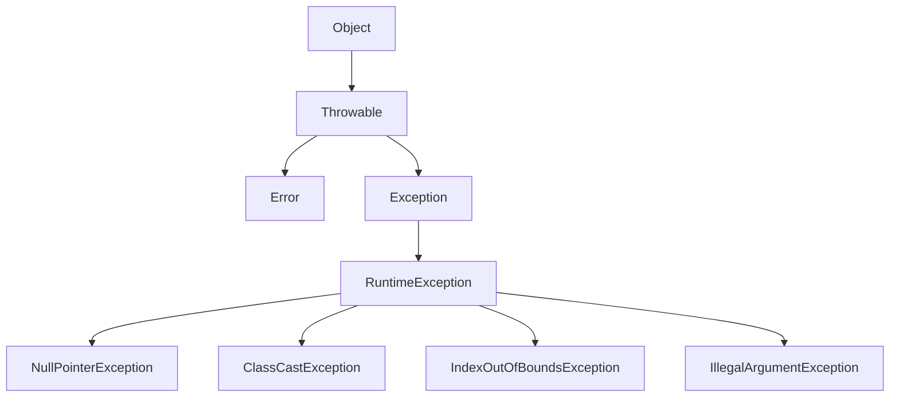

## 常见、核心异常类

### 关系图

### 核心运行时异常类
- NullPointException(空指针异常)：因为引用没有指向具体的实例对象，当访问这个引用的方法或者属性就会产生这种异常

- ClassCastException（类型转换异常）：因为JVM在检测到两个类型转换不兼容的运行时异常

- IndexOutOfBoundsException（索引越界异常）：当操作字符串或者数组 的时候经常遇到这种异常，他常见的形式是字符串的长度越界，或者数组的长度越界。通俗的说就是你以为数组长度有那么长，理所当然的操作了，但是实际上没那么长。

- IllegalArgumentException（非法参数异常）：参数是指给方法传递的参数，非法参数就是说你传递的参数不合法，你没有按照方法声明，传递正确的参数值。

以上四种异常是在工作中最常遇到的，当你的程序抛出了这些异常，你应该很快的明白他的 `RootCause` (根本原因)是什么，然后再跟据异常栈一步一步找到出错的代码，修改并解决问题。

所以学习这些核心异常类的目的，熟悉常见的Java异常，理解出错的原因，快速定位并修复问题。

## Throwable 类中的重要方法

- 四个构造方法
- getMessage：显示异常消息
- getLocalizedMessage：显示本地化的异常消息
- toString: 类名 + 异常消息
- printStackTrace：打印异常栈，有三个重载方法
- getStackTrace：获取异常栈的clone
