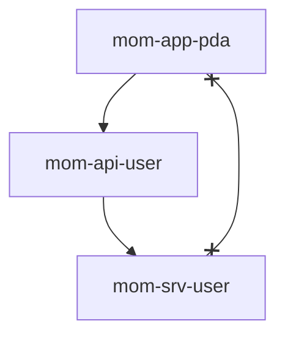

## 什么是Feign
Feign 是一个轻量级的 http 请求调用框架，可以通过 Java 接口注解的方式进行 Http 请求。Feign 通过注解处理，将请求模板化。在实际调用时，传入参数，并根据参数应用到请求上，最终转化为真正的请求。该框架封装了 http 调用流程，让其更加简单易用。

## 架构说明

如上图所示，“服务调用方 mom-app-pda”调用“服务提供方 mom-srv-user”的相关接口。因此，"mom-app-pda"服务需要引入 `mom-srv-user` 的 Maven 模块 `mom-api-user` 。 需要特别注意：引入是服务提供方的 API 模块,而不是引入 srv。

## 定义一个Feign

如上图所示，我们以 user 服务为例，展示如何定义 feign 调用。

- 如上文（一、架构说明）所述，Feign 客户端必须定义在 API 模块中。如果服务提供方没有 API 模块（例如 mp/pay 等模块），则需要自己创建对应的 Maven API 模块，参考 `mom-srv-user` 即可。

- feignclient 注解的 contextId 属性代表 bean 名称，在整个工程中必须唯一。

- feignclient 注解的 value 属性代表 **服务名**,通常可以写成常量，以免复制错误。

- Mapping 路径对应服务提供方接口路径（服务提供接口的 Controller Mapping + 接口 Mapping）。

## SPI文件声明

我们需要将 feignclient 所属类的全路径配置在 `META-INF/spring/org.springframework.cloud.openfeign.FeignClient.imports` 文件中

https://medium.com/@zhongyefeng/spring-cloud-openfeign-v4-0-3%E5%AE%9E%E7%8E%B0%E5%8E%9F%E7%90%86-5e486e4a70f1